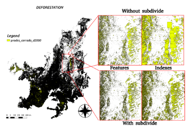
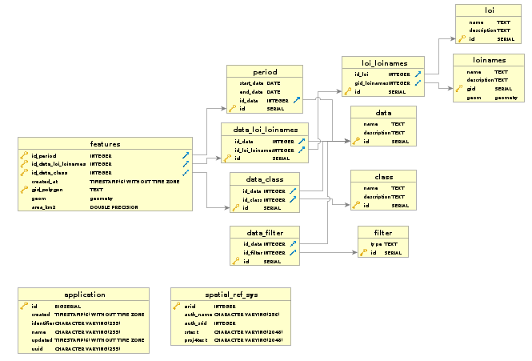

# Terrabrasilis Dashboard Data Model

Traditional SDIs such as TerraBrasilis require flexible data model design to deal with spatio-temporal, thematic and business data. Land-use and land-cover (LUCC) monitoring, for example, is continuously providing several types of knowledge to facilitate decision-making, which leads to an increasingly complexity. This scenario needs new forms of computer-aided methods such as visual analytics dashboards since they support a more complete representation of near-real time environmental trends, offering an easy-to-use approach for understanding and interpreting such information. 

They also remove great efforts to acquire and recognize current available data. With that in mind, it has been possible to explore and discover accumulated LUCC information by filtering what labels, when occurred and where is located with more clarity. Such analytics dashboards mitigate not only the tightly coupled relationship with not only pre-defined queries but also more sophisticated tools for participatory processes. Since LUCC data filtering are made normally manually, it hides lots of important information. For these reasons, relying on a representation that mitigates the natural complex of LUCC data aggregation as well as their changes in a more spontaneous way can support better analysis.

**terrabrasilis-dashboard-data-model** is a set of scripts to create and populate the Dashboard data model () from TerraBrasilis. 

## Getting started

Initialize private and public data model schema.

``` bash
./initialize-private-data-model-schema.sh user password host port dashboard-data-model
./initialize-public-data-model-schema.sh user password host port dashboard-data-model
```

Insert local of interests (e.g., amazon, cerrado, and legal amazon - states, municipalities, conservation units, indigeneous areas, and path row from Landsat, etc.)

``` bash
./insert-local-of-interests.sh user password host port dashboard-data-model
```

Insert deforestation raw data from PRODES (e.g., amazon, cerrado, and legal amazon - states, municipalities, conservation units, indigeneous areas, and path row from Landsat, etc.)

``` bash
./insert-raw-data.sh postgres user password host port dashboard-data-model
```

We also leverage a well-known technique to break large features down into small ones so each one of the remaining parts can be simply processed faster. In summary, it converts recursively features inputs into small fractions. It considers a number of maximum vertex parameters to each fractions and explores spatial indexes. 

<p align="center">

<p class="caption" align="center">
Figure 1 - Subdivide comparison with Deforestation Cerrado.
</p>
</p>

Run feature intersection to acquire and extract raw data areas that intersect some places, that is, according to specific local of interests.

``` bash
features/./parameters-features.sh user password host port dashboard-data-model
```

Figure 2 depicts an entity-relationship model for Terrabrasilis Dashboard. 

<p align="center">

<p class="caption" align="center">
Figure 2 - Entity-Relationship Model for TerraBrasilis Dashboard.
</p>
</p>

## Tests

How to run any test regarding specific loinames (e.g., Altamira) from a defined loi (e.g., municipalities) and periods of time (e.g., 2018) can be found below.

``` bash
tests/./test-amazon.sh user password host port dashboard-data-model loi loiname year
```

## References

Assis, L. F. F. G. A.; Ferreira, K. R.; Vinhas, L.; Maurano, L.; Almeida, C. A., Nascimento, J. R., Carvalho, A. F. A.; Camargo, C.; Maciel, A. M. TerraBrasilis: A Spatial Data Infrastructure for Disseminating Deforestation Data from Brazil. In Proceeding of the XIX Remote Sensing Brazilian Symposium, 2019.

## Reporting Bugs

Any problem should be reported to prodes@dpi.inpe.br.